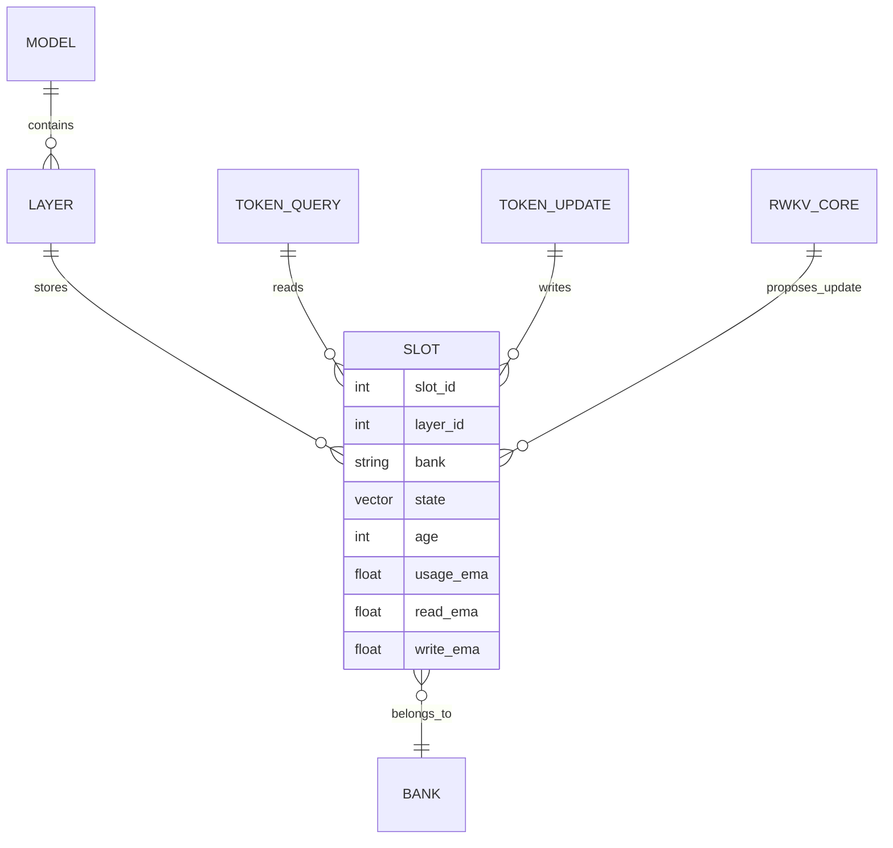
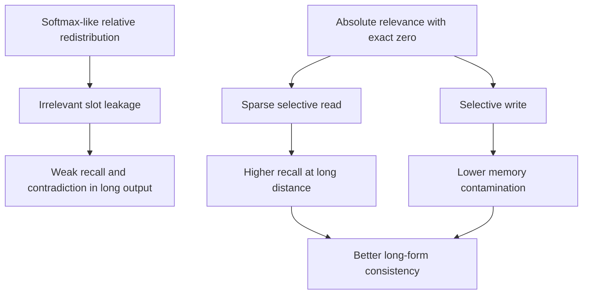
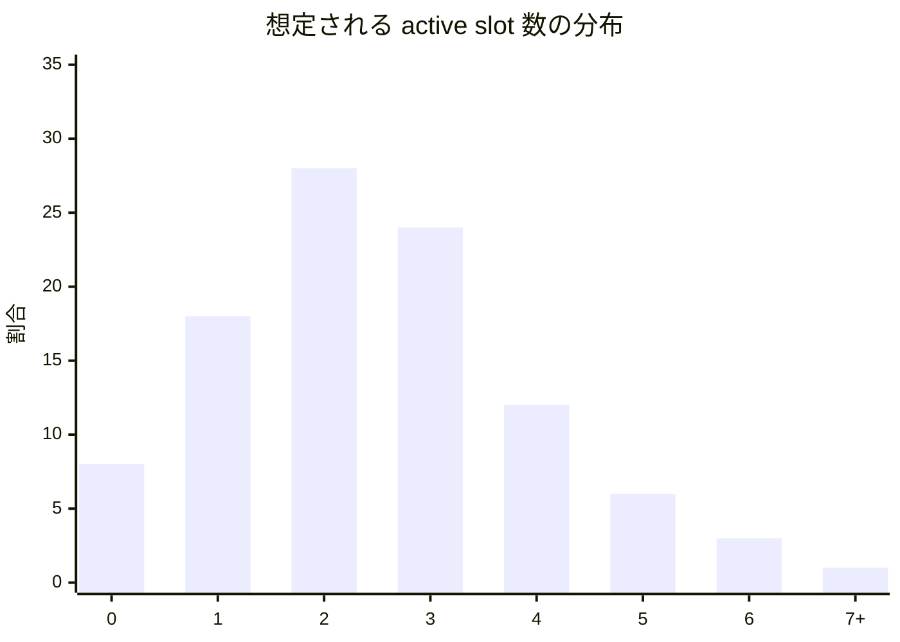
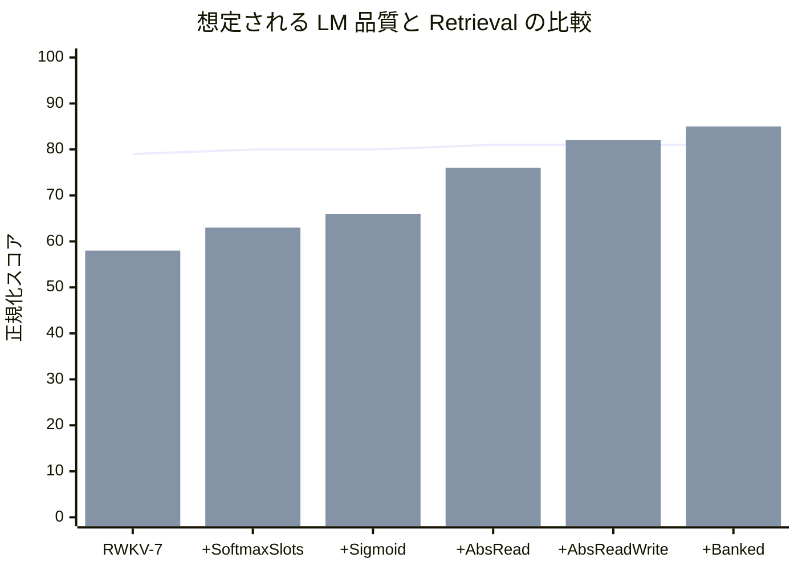

# RWKV 系 Recurrent LLM における Slot-Based Absolute Relevance Read/Write の学術的改訂草稿

## エグゼクティブサマリ

本稿の中心命題は、**Multiscreen の token-level screening をそのまま RWKV に移植するのではなく、RWKV 系の圧縮 recurrent state を固定個数の slot に分解し、各 slot に対して absolute relevance に基づく独立 read/write を与える**という設計を、学術論文として通る水準まで定式化し直すことにある。まず厳密に区別すべきなのは、この機構が**既存の公認標準モジュールではない**という点である。出発点となる設計仕様書自体が、そのことを明示している。fileciteturn0file0 Multiscreen は absolute relevance を与える screening を提案しているが、対象は token-to-token の明示比較であり、RWKV-7 は固定サイズの recurrent state と delta-rule 型更新をもつ別系統の architecture である。したがって、本提案の新規性は **Multiscreen の理論的直観を、RWKV の state access problem として再解釈すること**にある。citeturn4view0turn12view0

理論的な足場は強い。Multiscreen は、softmax attention では query-key relevance が競合 key に対する**相対配分**としてしか定義されず、真に relevant な key が存在しない場合でも何らかの質量が配られてしまう点を批判し、**bounded similarity・明示閾値・exact zero・非 sum-to-one 集約・TanhNorm**を組み合わせた screening を提案した。さらに、learned acceptance width を固定すると長文 perplexity と retrieval が悪化し、TanhNorm を除くと retrieval がとくに悪化し、MiPE を RoPE に置き換えると NoPE よりも強く悪化した。これらの結果は、提案法における read/write score・閾値学習・正規化・位置表現の扱いを決めるうえで直接的な設計根拠になる。citeturn4view0turn5view1turn5view2turn6view0turn7view0

RWKV 側との結合も理にかなっている。RWKV-7 “Goose” は、**constant memory usage** と **constant inference time per token** を掲げる recurrent/state-based architecture であり、generalized delta rule、vector-valued gating、vector-valued in-context learning rates、relaxed value replacement rule を導入している。さらに、理論的には state tracking と regular language recognition を一定層数で達成できると主張している。したがって、token 履歴を直接増やすのではなく、**固定個数の state slot に対する選択的 read/write** を追加する方針は、RWKV-7 の基本哲学と矛盾しない。むしろ、RWKV-7 自身が removal / replacement を分ける方向へ進化していることを踏まえると、read/write 分離は自然な extension である。citeturn12view0turn15view0turn15view2turn33view1

ただし、論文として最も重要な修正点は、**定義の曖昧さを排し、どこまでが既存研究でどこからが提案なのかを明確にすること**である。とくに score 関数については、現在の仕様書が採用している「\(\max(c-\tau,0)^2\) に近い簡略形」を、そのまま canonical Multiscreen formula と同一視してはならない。推奨すべきなのは、Multiscreen の acceptance-width 形式と**厳密に等価**な正規化済み threshold form、
\[
r_\tau(c)=\left[\max\left(\frac{c-\tau}{1-\tau+\varepsilon},0\right)\right]^2
\]
である。これは
\[
r_\rho(c)=\left[\max\left(1-\rho(1-c),0\right)\right]^2,\qquad \tau=1-\frac{1}{\rho}
\]
と等価であり、\(\tau\) を直接学習させた方が「どの cosine similarity 以上を受理するか」を記述しやすい。fixed acceptance width が不利だったという Multiscreen の ablation を考えると、**\(\tau\) は学習可能**にすべきである。fileciteturn0file0 citeturn5view1turn6view0

学習設計については、**Phase 分離**が必須である。第一段階では read-only phase を厳密に定義し、screening branch は read のみ担い、slot 更新は thresholded write ではなく bank-local な slow updater で行う。第二段階で write screening を有効化し、第三段階で bank migration や long-memory 保護を導入する。これは、Multiscreen が示した高 learning-rate stability を安易に RWKV 混成系へ持ち込むのではなく、RWKV-7 公式実装が強調する careful initialization・PreLN・projection matrix のみへの weight decay・parameter-group ごとの最適化方針を尊重するためである。RWKV-7 の公式実装は、reference implementation を明示するとともに、「単純な一層モジュール」では再現できないほど init / wd / lr が重要だと述べている。citeturn26view0turn26view1

正則化と dead-slot 対策は、論文の査読で必ず問われる。Multiscreen の exact-zero thresholding は selection の解釈性を与える一方、recurrent slot setting では gradient starvation の危険を持つ。そのため、学習初期には sigmoid あるいは leaky mixture を warm-up として使い、\(\tau\) を低めから anneal し、slot usage EMA・slot diversity loss・update penalty・long-bank write lock を段階的に導入する必要がある。ここで大事なのは、**dead-slot を事後診断だけでなく、訓練スケジュール上の一次設計変数に格上げすること**である。これは現行仕様書の dead-slot 問題意識を維持しつつ、研究計画として前景化した改訂点である。fileciteturn0file0 citeturn4view0turn5view1turn6view0

評価計画の中核は、**PPL だけでは採否を決めない**という点にある。Zoology は efficient language model の gap の大部分が associative recall で説明されると報告し、MQAR を導入して「実言語に近い recall」を formalize した。Lost in the Middle は relevant information が文脈中央にあると性能が大きく落ちることを示した。LongInOutBench は long-input / long-output generation benchmark の不足を指摘している。したがって、本提案の主評価は、PPL に加えて MQAR、associative recall、Lost-in-the-Middle、NIAH/passkey、そして**長文会話・創作整合性データセット**と**因果的介入実験**で構成されるべきである。citeturn13view1turn13view2turn30view0turn30view4turn12view4turn27view0turn31view0

最終的な採択可能性は、仮説の筋の良さではなく、**「compressed recurrent state を slot 化したときに、本当に意味的に分化した memory access が生まれるか」**を示せるかで決まる。もし結果が出るとすれば、最も強く現れるのは PPL の大改善ではなく、**retrieval・consistency・memory hygiene・因果的局在化**である可能性が高い。逆に、slot が意味単位に分化せず、単なる追加容量や gating の副作用に留まるなら、論文としては弱い。したがって、本稿が提案する査読対応版の核心は、**数式の厳密化、段階学習、強いベースライン、因果介入、内部状態統計の完全報告**にある。citeturn7view0turn13view1turn22view0turn23view0

## 導入

### 問題設定

長文文脈の扱いは依然として sequence modeling の中心課題である。Multiscreen は、学習時より長い文脈に出会ったときの困難は、計算量の問題だけではなく、**relevant information をどう選ぶか**という選択機構の問題でもあると論じた。softmax attention では score が unbounded で、weight は総和 1 の再配分であるため、query-key pair 自体の絶対的 relevance を独立に読めない。結果として、irrelevant key を clean に棄却できず、「relevant な文脈がない」という状態も表現しにくい。citeturn4view0

一方、efficient / recurrent 系モデルでは、問題の形がさらに厳しくなる。Zoology は、attention-free / gated-convolution 系モデルの言語 modeling gap の大部分が in-context recall に関係すると報告し、実言語では**複数回の recall、可変位置、語彙サイズの大きさ**が重要だと示した。また、同論文は recurrent models を「single hidden state を情報ボトルネックにもつ」ものとして位置づけている。RWKV 系はこの recurrent family に属するため、softmax の代替だけでなく、**圧縮 state の内部で何を読むか・どこへ書くか**を制御する設計が必要になる。citeturn13view1turn30view4turn32view2

この点で、RWKV-7 は興味深い出発点である。RWKV-7 は fixed-size state を用いる recurrent/state-based model であり、vector-valued gating と vector-valued in-context learning rates を備えた generalized delta rule を採用している。これは、state 内の更新を一様に扱うのではなく、**channel-wise に selective update する方向**へ既に進んでいることを意味する。slot-based absolute relevance read/write は、この選択性をさらに**slot 単位の read/write control**へ押し進める提案として位置づけられる。citeturn12view0turn15view0turn15view1

### 本稿の立場と仮定

本稿は、アップロード済みの設計仕様書を学術論文として改訂した**提案論文草稿**であり、Multiscreen や RWKV-7 にすでに存在する完成済みモジュールの説明ではない。元仕様書は、その立場を明確にしており、さらに unit norm、Trim-and-Square、TanhNorm、short/mid/long bank、read-only phase、read/write 分離など、多くの重要な構成要素を既に含んでいる。したがって本稿の役割は、その仕様を**既存研究と整合的な形で厳密化・正規化・実験可能化**することにある。fileciteturn0file0

また、実験予算・計算資源は未指定である。そこで本稿では、**同一 token budget 下の scratch training** と **公開 RWKV-7 checkpoint からの retrofit / continued pretraining** の二本立てを推奨する。これは、RWKV-7 論文自身が「architecture upgrade without pretraining from scratch」という方針を contribution の一つに挙げ、実際に earlier checkpoints から継続学習していること、さらに公式実装と公開 weights / dataset listing が利用可能であることに基づく。citeturn33view0turn33view1turn26view0

## 関連研究

### Absolute relevance と screening

Multiscreen は、screening を中心機構とする language-model architecture を提案し、**bounded similarity に explicit threshold をかけ、key ごとに独立に relevance を決める**という枠組みを導入した。これにより、irrelevant key は正確に zero へ落とせ、かつ「relevant な文脈が存在しない」状態も表現できる。加えて、MiPE は RoPE 風の回転を**最初の二次元だけ**に適用し、small window の場合のみ有効化する。さらに出力は TanhNorm で norm を制御し、learned screening window により不要な長距離計算を抑える。実験では、Transformer 基準に対して同等の validation loss をおおむねより少ない parameter で達成し、長文 perplexity、retrieval、latency でも有利な傾向が報告された。citeturn4view0turn5view2turn6view3turn7view0turn8view0

本提案にとって特に重要なのは Multiscreen の ablation である。MiPE を RoPE に置き換えると validation loss・長文 perplexity・retrieval が悪化し、NoPE の方がむしろ強い条件も見られた。TanhNorm を外すと retrieval が大きく落ち、acceptance width を固定すると long-context perplexity と retrieval の双方が悪化した。つまり、screening を単なる thresholding に単純化するのではなく、**threshold 学習、非正規化集約の norm 制御、位置表現の慎重な設計**を一体として扱う必要がある。citeturn5view1turn5view2turn6view0

### Recurrent / state-based long-context model

RWKV-7 は、constant memory usage と constant inference time per token を主張する recurrent/state-based model であり、generalized delta rule に vector-valued gating、vector-valued in-context learning rates、relaxed value replacement rule を導入している。さらに、state tracking と regular language recognition に関する理論結果を提示している。これらは、本提案が slot-based read/write を state evolution と**整合する形**で設計すべきことを示唆する。とくに RWKV-7 が removal 側と replacement 側の key を decouple する方向へ進んでいる点は、read score と write score の分離を強く後押しする。citeturn12view0turn15view0turn15view2

RetNet は、parallel・recurrent・chunkwise recurrent の三表現を同じ retention mechanism にもたせ、O(1) recurrent inference と efficient long-sequence modeling を両立しようとする。Mamba は selective SSM により linear-time sequence modeling を実現し、Mamba-2 は state-space duality に基づく refinement として 2–8 倍の高速化を報告している。DeltaNet は delta rule により additive state の限界を超えようとし、Gated DeltaNet は gating と delta rule が補完的で、retrieval や long-context tasks で Mamba2・DeltaNet を上回ると報告する。したがって、提案法が比較されるべき相手は単なる RWKV baseline だけではなく、**retention / selective SSM / delta-rule 系全体**である。citeturn12view1turn1search1turn17search0turn28view0turn28view1

### Recall と long-context 評価

Zoology は、17 個の attention / gated-convolution models を比較し、state-of-the-art gated-convolution architectures でも The Pile 上で最大 2.1 perplexity point attention に劣ること、しかもその gap の 82% が associative recall に由来することを示した。また、70M attention model が 1.4B gated-convolution model を associative recall で上回るという結果を報告し、MQAR を導入して「一つの query を一回引く」古典的 synthetic recall ではなく、**複数 recall・可変位置・大語彙**の設定が必要だと論じた。さらに付録では 350M RWKV の associative recall failure examples も示している。citeturn12view3turn13view1turn13view2turn13view3turn30view0turn30view4turn32view0

Lost in the Middle は、relevant information が context の中間にあると性能が大きく落ちることを multi-document QA と key-value retrieval で示した。NIAH は長い文脈の途中に random needle を挿入し、needle depth と context length を振って retrieval accuracy を測る手法として広く使われている。さらに LongInOutBench は、既存手法が short-input / long-output に偏り、**long-input / long-output generation の benchmark が不足している**ことを指摘した。提案法が「長文会話・創作整合性」を射程に入れるなら、これらの retrieval benchmark に加えて、long input / long output の生成評価が必要である。citeturn12view4turn31view0turn27view0

### 解釈可能性と因果検証

内部 relevance の可視化は、それだけでは「解釈可能性」の証明にならない。ROME は factual association の局在化に causal tracing を導入し、決定的な内部状態を介入によって特定した。Activation patching の best-practice 研究は、patching の結果が metric や corruption 方法に強く依存しうることを示し、解釈実験の protocol そのものを厳密化すべきだと論じている。さらに MambaLRP は、Mamba 系の selective state-space model に faithful explanation を持ち込むには、architecture 固有の問題を明示的に扱わなければならないと指摘した。したがって、本提案の “interpretability” は、単なる relevance heatmap ではなく、**ablation / patching / counterfactual write suppression を通じた causal verification** を伴って初めて成立する。citeturn21search0turn22view0turn23view0

## 理論的動機と数式定義

### 理論的動機

本提案の理論的核は、**RWKV の state bottleneck を、absolute relevance をもつ fixed-size slot memory として再編成する**ことにある。Zoology が指摘するように、recurrent model は単一 hidden state を information bottleneck としやすい。これをそのままにすると、長距離 recall と selective update が衝突しやすい。そこで、圧縮 state を \(M\) 個の slot に分け、各 slot に対して independently thresholded read/write を定義すれば、固定メモリ性を維持しながら、**どの内部記憶を読むか／どこに新情報を書くか**を別々にモデル化できる。これは Multiscreen の absolute relevance の直観と、RWKV-7 / Gated DeltaNet の selective update の直観を接続するものと考えられる。citeturn32view2turn4view0turn15view0turn28view0

### 記号表

以下では、1 層あたりの定義を与える。多層拡張は層添字 \(\ell\) を付ければよい。

| 記号 | 意味 |
|---|---|
| \(t\) | token step |
| \(\ell\) | layer index |
| \(d\) | model width |
| \(d_s\) | slot state width |
| \(d_k\) | screening key/query width |
| \(d_v\) | screening value width |
| \(M\) | slot 数 |
| \(x_t^\ell \in \mathbb{R}^{d}\) | layer \(\ell\) の入力 hidden |
| \(R_t^\ell\) | RWKV core の recurrent state |
| \(S_t^\ell=\{s_{t,m}^\ell\}_{m=1}^M\) | slot bank |
| \(b(m)\) | slot \(m\) の bank ラベル |
| \(a_{t,m}^\ell\) | slot age |
| \(u_{t,m}^\ell\) | slot usage EMA |
| \(r_{t,m}^{read,\ell}\) | read relevance |
| \(r_{t,m}^{write,\ell}\) | write relevance |

**重要な制約**として、\(M\) は context length に依存しない固定値にする。そうしないと、RWKV の constant-memory / constant-time per token という利点を損ないやすいからである。RWKV-7 自体が hidden state だけで次状態を計算する RNN として提示されている以上、slot branch もこの原則と整合的であるべきである。citeturn26view1turn26view2

### 推奨定式化

現在 token の hidden から read query を作る。

\[
q_t^{r,\ell}=W_q^{r,\ell}\,\mathrm{LN}(x_t^\ell)
\]

slot から key / value を作る。

\[
k_{t,m}^\ell=W_k^\ell s_{t-1,m}^\ell,\qquad
v_{t,m}^\ell=W_v^\ell s_{t-1,m}^\ell
\]

Multiscreen の設計意図に合わせ、query・key・value は unit normalization を基本とする。

\[
\bar q_t^{r,\ell}=\frac{q_t^{r,\ell}}{\lVert q_t^{r,\ell}\rVert_2+\varepsilon},\qquad
\bar k_{t,m}^{\ell}=\frac{k_{t,m}^{\ell}}{\lVert k_{t,m}^{\ell}\rVert_2+\varepsilon},\qquad
\bar v_{t,m}^{\ell}=\frac{v_{t,m}^{\ell}}{\lVert v_{t,m}^{\ell}\rVert_2+\varepsilon}
\]

これにより similarity は

\[
c_{t,m}^{r,\ell}=\langle \bar q_t^{r,\ell},\bar k_{t,m}^{\ell}\rangle\in[-1,1]
\]

となる。Multiscreen は q/k の bounded similarity によって thresholding を well-defined にし、さらに value normalization によって large value norm が aggregation を支配することを防いでいる。提案法でもこの役割は基本的に維持すべきである。citeturn7view0

### Read/Write スコア候補と推奨式

score 関数の候補は、理論的性質と最終論文での説明可能性の両面から比較すべきである。以下の候補群は、Multiscreen の Trim と、現在の設計仕様書で想定されている thresholded slot scoring を踏まえて整理したものである。fileciteturn0file0 citeturn7view0turn6view0

| 候補 | 数式 | exact zero | 学習可能閾値 | 用途 | 判定 |
|---|---|---:|---:|---|---|
| Canonical Trim | \(\displaystyle r_\rho(c)=\left[\max(1-\rho(1-c),0)\right]^2,\ \rho>1\) | はい | \(\rho\) | Multiscreen 準拠 | 主要候補 |
| 正規化 \(\tau\)-Trim | \(\displaystyle r_\tau(c)=\left[\max\left(\frac{c-\tau}{1-\tau+\varepsilon},0\right)\right]^2\) | はい | \(\tau\) | 解釈しやすい論文表記 | **推奨** |
| Sigmoid gate | \(\displaystyle r_{\text{sig}}(c)=\sigma(\gamma(c-\tau))\) | いいえ | \(\tau\) | warm-up / dead-slot 対策 | 補助候補 |
| Hard top-\(k\) | 上位 \(k\) slot のみ採用 | はい | 実質なし | 比較ベースライン | 主要法には非推奨 |

本稿の推奨式は **正規化 \(\tau\)-Trim** である。理由は二つある。第一に、\(\tau\) がそのまま cosine similarity の受理閾値になるため、論文本文での意味づけが容易である。第二に、これは canonical Trim と**厳密に等価**に書ける。実際、
\[
\tau = 1-\frac{1}{\rho}
\]
と置くと \(1-\tau = 1/\rho\) なので、
\[
\left[\max\left(\frac{c-\tau}{1-\tau},0\right)\right]^2
=
\left[\max\left(\rho(c-\tau),0\right)\right]^2
=
\left[\max\left(1-\rho(1-c),0\right)\right]^2
\]
である。したがって、現在の仕様書に見られる「\(\max(c-\tau,0)^2\) で近似する」書き方は、最終稿では**“同値”ではなく scale を落とした簡略形**として訂正すべきである。さらに、Multiscreen では fixed acceptance width が不利だったため、\(\tau\) は固定ではなく学習可能にするのが妥当である。fileciteturn0file0 citeturn5view1turn6view0

したがって、read relevance の content term は

\[
r_{t,m}^{content,\ell}
=
\left[
\max\left(
\frac{c_{t,m}^{r,\ell}-\tau_r^\ell}{1-\tau_r^\ell+\varepsilon},
0
\right)
\right]^2
\]

と定義する。Threshold parameter は

\[
\tau_r^\ell = 2\sigma(\theta_r^\ell)-1
\]

のように parameterize するのが扱いやすい。write も同型でよいが、query は read とは分ける。

\[
q_t^{w,\ell}=W_q^{w,\ell}\,\mathrm{LN}\!\big([x_t^\ell;h_t^{base,\ell}]\big)
\]

\[
c_{t,m}^{w,\ell}=\left\langle
\frac{q_t^{w,\ell}}{\|q_t^{w,\ell}\|_2+\varepsilon},
\frac{W_{k,w}^\ell s_{t-1,m}^\ell}{\|W_{k,w}^\ell s_{t-1,m}^\ell\|_2+\varepsilon}
\right\rangle
\]

\[
r_{t,m}^{write,\ell}
=
\left[
\max\left(
\frac{c_{t,m}^{w,\ell}-\tau_w^\ell}{1-\tau_w^\ell+\varepsilon},
0
\right)
\right]^2
\]

Gated DeltaNet が「gating は rapid erasure を、delta rule は targeted update を担うので補完的だ」と述べ、RWKV-7 が removal / replacement の decoupling を進めていることを踏まえると、read と write を同一 score に潰さない方が理論的一貫性が高い。citeturn28view0turn15view0

### Age mask と bank bias

Multiscreen の Softmask は token distance を使うが、slot setting では token index をそのまま持ち込むべきではない。Multiscreen 自体が MiPE を small window に限定し、RoPE 置換が不利であることを示した以上、slot index に token positional geometry を直貼りする根拠は弱い。そこで提案法では、distance-aware term を **slot age** と **bank prior** に写像する。citeturn5view2turn5view1

\[
g_{t,m}^{age,\ell}
=
\sigma\!\left(
\frac{\omega_{b(m)}^\ell-a_{t,m}^\ell}{\sigma_{b(m)}^\ell+\varepsilon}
\right),
\qquad
g_m^{bank,\ell}=\sigma(\beta_{b(m)}^\ell)
\]

\[
r_{t,m}^{read,\ell}
=
r_{t,m}^{content,\ell}\cdot g_{t,m}^{age,\ell}\cdot g_m^{bank,\ell}
\]

この設計は、Multiscreen に見られる「多くの局所 unit と少数の広域 unit」という learned window 分布や、MT-LSTM における multi-timescale memory groups とも整合的である。つまり、slot bank は token position の代用品ではなく、**time scale の異なる internal memory strata** として扱うべきだということである。citeturn6view0turn6view3turn25view0

### 集約、TanhNorm、RWKV core との融合

非正規化 relevance で surviving value を集める。

\[
z_t^\ell=\sum_{m=1}^{M} r_{t,m}^{read,\ell}\,\bar v_{t,m}^{\ell}
\]

提案法では、実装しやすく cap を明示できる version として、次の TanhNorm を推奨する。

\[
\operatorname{TanhNorm}_C(z)
=
C\tanh\!\left(\frac{\|z\|_2}{C}\right)\frac{z}{\|z\|_2+\varepsilon}
\]

\[
u_t^\ell=\operatorname{TanhNorm}_C(z_t^\ell)
\]

Multiscreen は TanhNorm を unnormalized aggregation の norm control のために導入しており、除去すると retrieval が大きく悪化した。よって、RWKV 版でも TanhNorm は optional trick ではなく、**定義の一部**として扱うべきである。なおここで与えた式は、論文の役割に忠実な implementation-ready form であり、Multiscreen の式をそのまま写したというより、その目的に沿って明示的な cap \(C\) を導入した再定式化である。fileciteturn0file0 citeturn5view1turn7view0

RWKV core との融合は residual read branch とする。

\[
h_t^{base,\ell},R_t^\ell=\operatorname{RWKVCore}^\ell(x_t^\ell,R_{t-1}^\ell)
\]

\[
h_t^\ell
=
h_t^{base,\ell}
+
\lambda_\ell\,
\sigma\!\big(W_g^\ell \mathrm{LN}(x_t^\ell)+b_g^\ell\big)\odot W_o^\ell u_t^\ell
\]

ここで \(\lambda_\ell\) は小さな初期値から始める。学習初期の branch dominance を避けるためである。citeturn26view0

### Write update と slot lifecycle

write では hard overwrite ではなく、slow convex update を推奨する。

\[
\Delta s_{t,m}^\ell
=
\tanh\!\left(
W_\Delta^\ell[\mathrm{LN}(x_t^\ell);h_t^\ell;e_m^\ell]
\right)
\]

\[
s_{t,m}^\ell
=
s_{t-1,m}^\ell
+
\mu_{b(m)}^\ell\,
r_{t,m}^{write,\ell}
\left(\Delta s_{t,m}^\ell-s_{t-1,m}^\ell\right)
\]

ただし \(\mu_{long}<\mu_{mid}<\mu_{short}\) とする。RWKV-7 と Gated DeltaNet の文脈では、「何をどれだけ消すか／差し替えるか」を data-dependent に制御することが重要であり、長期記憶を short-term event と同じ rate で更新すべきではない。citeturn15view0turn28view0

age と usage は以下で更新する。

\[
a_{t,m}^\ell=
\begin{cases}
0,& r_{t,m}^{write,\ell}>\eta_{age}\\[4pt]
a_{t-1,m}^\ell+1,& \text{otherwise}
\end{cases}
\]

\[
u_{t,m}^\ell=\beta_u u_{t-1,m}^\ell + (1-\beta_u)\,\mathbf{1}[r_{t,m}^{read,\ell}>\eta_u]
\]

bank migration は提案事項として、最低限次の条件を置く。

\[
\text{short}\rightarrow \text{mid}
\quad \text{if}\quad
u_{t,m}^\ell>\theta_{promote}^{(s)}
\ \land\
a_{t,m}^\ell>A_s
\]

\[
\text{mid}\rightarrow \text{long}
\quad \text{if}\quad
u_{t,m}^\ell>\theta_{promote}^{(m)}
\ \land\
\overline{r^{write}}_{t,m}^\ell>\theta_w
\ \land\
\text{contradiction\_score}_{t,m}<\theta_c
\]

ここで contradiction score は後述する counterfactual consistency probe から得る。長期 bank への昇格条件は、単に「よく読まれる」だけでなく、「書き込みが安定しており、反事実的差し替えに弱くない」ことを要求する。これは解釈性と記憶衛生を両立させるための措置である。fileciteturn0file0

以下の ER 図は、論文本文で提示すべき entity 関係を整理したものである。



## 実装仕様と学習設計

### Slot 初期化と推奨実装

RWKV-7 の公式 reference implementation は、PreLN、careful initialization、projection matrix のみに対する weight decay、parameter-group ごとの lr/wd 設計を重視している。また trainable initial state はその LayerNorm setting では有益でなかったと述べている。したがって、slot 初期値も「大きな trainable memory content」ではなく、**低容量・低ノルム・対称性を壊すだけの識別子**として始めるのが安全である。citeturn26view0

| 初期化案 | 長所 | 短所 | 推奨判定 |
|---|---|---|---|
| \(s_{0,m}=0\), 別途 slot ID embedding \(e_m\) を使う | 最も安定、解釈が容易、初期 memory を仮定しない | 立ち上がりが遅い | **from-scratch の第一候補** |
| \(s_{0,m}=\alpha e_m\), \(\alpha\ll 1\), \(e_m\) は直交 | 対称性を早く破る | seed 自体が記憶として振る舞う危険 | 第二候補 |
| random Gaussian learned content | 立ち上がりは速い | scale 事故、解釈性低下、再現性悪化 | 非推奨 |
| checkpoint 由来 hidden summary 初期化 | retrofit で有利な可能性 | 手続き依存、論文比較が複雑 | retrofit の補助実験 |

したがって、**scratch study では zero-content + learned orthogonal slot-ID embeddings** を推奨する。retrofit study では checkpoint 依存初期化を別表として追加すればよいが、本体の main result とは分けて報告すべきである。citeturn26view0turn33view0

### Read-only フェーズの厳密定義

read-only は曖昧に使ってはならない。本稿では次のように定義する。

\[
\textbf{Read-only phase:}
\quad
r_{t,m}^{write,\ell}\ \text{branch を持たない}
\]

\[
s_{t,m}^\ell
=
s_{t-1,m}^\ell
+
\bar\mu_{b(m)}^\ell\,
\omega_{t,m}^\ell
(\Delta s_{t,m}^\ell-s_{t-1,m}^\ell),
\qquad
\omega_{t,m}^\ell=\sigma(W_\omega^\ell[\mathrm{LN}(x_t^\ell);s_{t-1,m}^\ell;e_m^\ell])
\]

すなわち、**screening は read にのみ使い、slot 更新は非 thresholded な slow updater で行う**。これにより、「retrieval branch の価値」と「write gating の価値」をアブレーションで切り分けられる。現行仕様書の “read-only” を論文に載せるなら、この定義水準まで明記しなければならない。fileciteturn0file0

### Python 風疑似コード

以下は論文本文あるいは appendix に載せるのに十分な簡約 pseudocode である。RWKV-7 公式実装の optimizer grouping を尊重しつつ、新規 screening branch を追加する想定である。citeturn26view0

```python
class SlotScreenRWKVLayer(nn.Module):
    def __init__(self, d_model, d_slot, d_k, d_v, n_slots, bank_ids):
        super().__init__()
        self.qr = nn.Linear(d_model, d_k, bias=False)
        self.qw = nn.Linear(2 * d_model, d_k, bias=False)
        self.k_proj = nn.Linear(d_slot, d_k, bias=False)
        self.v_proj = nn.Linear(d_slot, d_v, bias=False)
        self.out = nn.Linear(d_v, d_model, bias=False)
        self.gate = nn.Linear(d_model, d_model, bias=True)
        self.delta = nn.Linear(2 * d_model + d_slot, d_slot, bias=True)
        self.slot_id = nn.Parameter(torch.empty(n_slots, d_slot))
        nn.init.orthogonal_(self.slot_id)

        self.tau_r = nn.Parameter(torch.zeros(()))
        self.tau_w = nn.Parameter(torch.zeros(()))
        self.bank_lr = nn.ParameterDict({
            "short": nn.Parameter(torch.tensor(-3.0)),
            "mid":   nn.Parameter(torch.tensor(-4.0)),
            "long":  nn.Parameter(torch.tensor(-5.0)),
        })
        self.bank_ids = bank_ids  # list[str] length n_slots

    @staticmethod
    def unit(x, eps=1e-6):
        return x / x.norm(dim=-1, keepdim=True).clamp_min(eps)

    @staticmethod
    def trim_square(sim, tau, eps=1e-6):
        # tau in (-1, 1)
        return torch.relu((sim - tau) / (1 - tau + eps)).square()

    @staticmethod
    def tanhnorm(x, cap=1.0, eps=1e-6):
        norm = x.norm(dim=-1, keepdim=True).clamp_min(eps)
        return cap * torch.tanh(norm / cap) * (x / norm)

    def forward(self, x_t, rwkv_core, slots, ages, phase="read_only"):
        # RWKV core
        h_base, rwkv_state = rwkv_core(x_t)

        # read branch
        q_r = self.unit(self.qr(F.layer_norm(x_t, x_t.shape[-1:])))                  # (B, d_k)
        k = self.unit(self.k_proj(slots))                                            # (B, M, d_k)
        v = self.unit(self.v_proj(slots))                                            # (B, M, d_v)
        sim_r = torch.einsum("bd,bmd->bm", q_r, k)                                   # (B, M)
        tau_r = 2 * torch.sigmoid(self.tau_r) - 1
        rel_r = self.trim_square(sim_r, tau_r)

        # simple age mask; replace with learnable per-bank mask in full impl
        age_mask = torch.sigmoid((32.0 - ages.float()) / 8.0)
        rel_r = rel_r * age_mask

        z = torch.einsum("bm,bmd->bd", rel_r, v)
        u = self.tanhnorm(z)
        h = h_base + torch.sigmoid(self.gate(x_t)) * self.out(u)

        # candidate slot update
        sid = self.slot_id.unsqueeze(0).expand(slots.size(0), -1, -1)
        x_rep = x_t.unsqueeze(1).expand(-1, slots.size(1), -1)
        h_rep = h.unsqueeze(1).expand(-1, slots.size(1), -1)
        delta = torch.tanh(self.delta(torch.cat([x_rep, h_rep, sid], dim=-1)))

        if phase == "read_only":
            # no thresholded write branch
            for m, bank in enumerate(self.bank_ids):
                mu = torch.sigmoid(self.bank_lr[bank])
                slots[:, m] = slots[:, m] + mu * (delta[:, m] - slots[:, m])
        else:
            q_w = self.unit(self.qw(F.layer_norm(torch.cat([x_t, h_base], dim=-1),
                                                 (2 * x_t.shape[-1],))))
            sim_w = torch.einsum("bd,bmd->bm", q_w, k)
            tau_w = 2 * torch.sigmoid(self.tau_w) - 1
            rel_w = self.trim_square(sim_w, tau_w)

            for m, bank in enumerate(self.bank_ids):
                mu = torch.sigmoid(self.bank_lr[bank])
                slots[:, m] = slots[:, m] + mu * rel_w[:, m:m+1] * (delta[:, m] - slots[:, m])

            ages = torch.where(rel_w > 1e-3, torch.zeros_like(ages), ages + 1)

        stats = {
            "rel_read": rel_r,
            "active_slots": (rel_r > 1e-3).sum(dim=-1),
        }
        return h, rwkv_state, slots, ages, stats
```

### 学習スケジュール

Multiscreen は大きい learning rate でも安定したが、そのまま hybrid RWKV に移植してよいとは言えない。RWKV-7 側は reference implementation と optimizer grouping の重要性を強調しているため、**段階学習**が不可欠である。citeturn7view0turn26view0

| フェーズ | 学習対象 | 凍結対象 | 目的 | 推奨長さ |
|---|---|---|---|---|
| Warm-up | read branch, \(W_q,W_k,W_v,W_o,W_g\) | write branch, bank migration | branch を destabilize せず立ち上げる | 総 step の 5–10% |
| Read-only | read branch + slow slot updater | thresholded write | retrieval gain の純粋評価 | 総 step の 30–50% |
| Read/Write | 全 screening branch | bank migration の一部 | memory hygiene 改善 | 総 step の 30–40% |
| Full model | screening + bank migration + optional write locks | なし | 最終調整と ablation | 残り |

Optimizer group は少なくとも三つに分ける。第一群は RWKV-7 本体の projection matrices で、reference implementation の wd/lr に従う。第二群は screening の線形射影 \(W_q,W_k,W_v,W_o,W_g\) で、matrix parameter として本体に近い wd を与える。第三群は \(\tau\)、bank bias、update rate、age-window のような scalar / vector parameter で、**weight decay をかけない**。RWKV-7 公式実装が「weight decay は large matrix parameters にのみ適用すべき」と強調している以上、この方針は守るべきである。citeturn26view0

### 正則化と dead-slot 対策

dead-slot は本提案の重要な failure mode である。Multiscreen の zero-threshold は selection の利点そのものだが、slot branch では一度 inactive になった slot が長く戻らない危険がある。そのため、以下の対策を**学習後半の診断項目ではなく、訓練設計の一部**として採用する。citeturn4view0turn6view0

| 機構 | 定義 | 適用段階 | 目的 |
|---|---|---|---|
| Threshold annealing | \(\tau\) を低値から目標値へ単調増加 | warm-up から | 初期の gradient starvation を防ぐ |
| Leaky warm-up | \(r=(1-\alpha)r_\tau + \alpha \sigma(\gamma(c-\tau))\), \(\alpha\downarrow 0\) | warm-up のみ | dead-slot の初期発生を抑える |
| Usage floor loss | \(\mathcal L_{\text{dead}}=\frac1M\sum_m \max(0,u_{\min}-\bar u_m)^2\) | read-only 後半から | inactive slot を減らす |
| Diversity loss | \(\mathcal L_{\text{div}}=\frac{1}{M(M-1)}\sum_{i\neq j}\cos^2(\bar k_i,\bar k_j)\) | 全期間 | slot collapse を抑える |
| Update penalty | \(\mathcal L_{\text{upd}}=\frac1M\sum_m \|s_{t,m}-s_{t-1,m}\|_2^2\) | read/write 以降 | 書き換え過多を防ぐ |
| Long-bank lock | long slot の write に係数 \(\lambda_{lock}>1\) を掛けて抑制 | read/write 以降 | memory hygiene を守る |

総損失は
\[
\mathcal L
=
\mathcal L_{LM}
+
\alpha_{dead}\mathcal L_{dead}
+
\alpha_{div}\mathcal L_{div}
+
\alpha_{upd}\mathcal L_{upd}
+
\alpha_{lock}\mathcal L_{lock}
\]
とする。ただし最初から全て入れるのではなく、**warm-up では \(\mathcal L_{LM}\) のみ**、dead-slot 兆候が見えてから補助損失を足す方がよい。強すぎる usage loss は「すべての slot を無理に使う」方向へ流れ、absolute relevance の利点を壊すからである。citeturn4view0turn5view1

### 実行フロー

以下のプロセス図は、論文本文に載せるべき read/write フローの要約である。

```mermaid
flowchart LR
    X[x_t] --> LN[PreLN]
    LN --> QR[Read query projection]
    LN --> CORE[RWKV core]
    S[Slot bank S_{t-1}] --> KV[Key / Value projection]
    QR --> UQ[Unit norm]
    KV --> UKV[Unit norm]
    UQ --> SIMR[Cosine similarity]
    UKV --> SIMR
    SIMR --> TRIMR[Trim-and-Square read]
    TRIMR --> MASK[Age / Bank mask]
    MASK --> AGG[Unnormalized aggregation]
    AGG --> TN[TanhNorm]
    CORE --> FUSE[Residual fusion]
    TN --> FUSE
    FUSE --> H[h_t]

    H --> DELTA[Candidate slot update]
    H --> QW[Write query projection]
    UKV --> SIMW[Write similarity]
    QW --> SIMW
    SIMW --> TRIMW[Trim-and-Square write]
    TRIMW --> UPD[Bank-aware slow update]
    DELTA --> UPD
    UPD --> S2[Slot bank S_t]
```

### 計算コストと latency 評価法

解析的には、naive 実装の追加コストは層ごとに概ね
\[
\mathcal O(M d_s d_k + M d_s d_v + M d_k + M d_v)
\]
であり、\(M\) が固定なら文脈長 \(T\) に対して per-token cost は定数である。これは RWKV の fixed-state principle と整合するが、**実測 latency は kernel 実装次第**である。Multiscreen が window skip の有無で latency trade-off を示したように、提案法でも active slot を使った kernel 最適化をしなければ理論優位は埋もれうる。citeturn6view3turn7view0

そこで論文では次の四指標を報告すべきである。

| 指標 | 測定法 |
|---|---|
| Prefill latency | 長文 prompt 全体を一括で通す wall-clock time |
| Decode latency | state を持ち回った 1 token あたり ms/token |
| Memory footprint | recurrent state + slot bank + any cached \(k/v\) の bytes |
| Active compute ratio | \(\mathbb E[|\{m:r_{t,m}^{read}>\eta\}|/M]\) |

測定プロトコルは、Multiscreen に倣って batch size 1、bf16、同一 GPU、100 回反復の平均を推奨する。ただし recurrent model では full-context forward pass だけでなく、**decode latency** を必ず分離して報告する必要がある。RWKV 系の本質的優位は per-token state carry にあるからである。hardware 依存性と kernel precision handling の重要性は、Multiscreen と RWKV-7 の両方が明示している。citeturn7view0turn26view0turn33view2

## 評価計画と実験プロトコル

### 比較ベースライン

ベースラインは、**capacity 増加の効果**、**relative vs absolute weighting**、**state-based family 内の位置づけ**を切り分けるように設計すべきである。RWKV-7 は本体 baseline、RetNet は retention family、Mamba / Mamba-2 は selective SSM、DeltaNet / Gated DeltaNet は delta-rule retrieval baseline を与える。softmax over slots・sigmoid gate memory・top-\(k\) selection は、提案の本質である “absolute relevance with exact zero and learnable threshold” を検証するための internal controls である。citeturn12view0turn12view1turn1search1turn17search0turn28view0turn28view1

| ベースライン | マッチ条件 | 何を検証するか |
|---|---|---|
| RWKV-7 標準 | 同 token budget | 最低限の主比較 |
| RWKV-7 widened | 同 parameter / 同 FLOPs | 「追加容量」だけで gains が出ていないか |
| RWKV-7 + softmax over slots | 同 parameter | relative redistribution vs absolute relevance |
| RWKV-7 + top-\(k\) slots | 同 parameter | threshold 学習なしの sparsity control |
| RWKV-7 + sigmoid gate memory | 同 parameter | independent weighting だが exact zero なし |
| RetNet | 近い scale / token budget | recurrent/retention family 比較 |
| Mamba または Mamba-2 | 近い scale / token budget | selective SSM 比較 |
| DeltaNet または Gated DeltaNet | 近い scale / token budget | delta-rule retrieval baseline |

最低限必要なのは、**RWKV-7 / widened RWKV-7 / softmax-slots / sigmoid-slots / 提案法**の五者比較である。査読では「slot branch が単なる余分な MLP ではないか」が確実に問われるため、same-param と same-FLOPs の control は省けない。citeturn7view0turn28view0turn28view1

### 評価タスク

Zoology、Lost in the Middle、NIAH、LongInOutBench の知見を踏まえると、評価は少なくとも次の五群からなるべきである。citeturn13view1turn30view4turn12view4turn31view0turn27view0

| タスク群 | 具体設定 | 主指標 | 役割 |
|---|---|---|---|
| 言語モデリング | validation loss / PPL | PPL, BPC | 標準品質確認 |
| MQAR / associative recall | Zoology 準拠 MQAR + natural AR slices | exact match, accuracy | recall の本丸 |
| Lost-in-the-Middle | key-value retrieval / QA の位置 sweep | depth-wise accuracy | 中央劣化の検証 |
| 長文会話・創作整合性 | 人物設定 A/B、伏線保持、章跨ぎ再参照 | contradiction rate, persona-F1, foreshadow recall | 実運用適合性 |
| 因果的介入 | write 禁止、read shuffle、slot ablation、slot patching | \(\Delta\)logit, recovery rate | interpretability の因果検証 |

#### 言語モデリング

主比較は matched token budget で行う。Multiscreen が SlimPajama で、Zoology が The Pile で architecture comparisons を行っているため、再現性を優先するなら small / medium scale の scratch study は **SlimPajama または The Pile subset** が妥当である。大規模 compute が未指定である以上、公開 RWKV-7 checkpoints を用いた continued pretraining を practical track とし、scratch study を clean science track として分けるべきである。citeturn7view0turn12view3turn33view1

#### MQAR / associative recall

MQAR は、従来の「一つの query を特定位置で引く」synthetic recall より、実言語の recall に近い。Zoology は、従来 formulations が一 query・固定位置・小語彙に偏っていたと指摘し、MQAR で multiple recall / variable position / large vocabulary の条件を重視した。提案法はまさに state bottleneck の内部で multiple memory access を制御しようとするため、**MQAR を primary scientific benchmark** に置くべきである。citeturn30view4turn30view0

#### Lost-in-the-Middle

Lost in the Middle は、relevant information が中間位置へ動くだけで性能が落ちることを示した。slot-based screening が本当に “needle depth” に頑健なら、beginning / middle / end の落差は RWKV baseline より縮まるはずである。ここでは retrieval accuracy だけでなく、**active slot 数の depth 依存性**も同時に記録する。深い位置で active slot 数だけ増えて精度が伸びないなら、selection が鈍っている可能性が高い。citeturn12view4

#### 長文会話・創作整合性データセット

LongInOutBench が long-input / long-output benchmark の不足を指摘していることを踏まえ、本提案では以下の独自データセットを構築するのが望ましい。これは published benchmark の代替ではなく、**本提案のユースケースに対する必要追加**である。citeturn27view0

- **人物設定 A/B**: 同名あるいは類似属性の人物二名を長文の離れた位置に配置し、後半 continuation で誤帰属を測る。
- **伏線保持**: 序盤の object / motive / promise を中盤で長く distract した後、終盤 continuation で回収させる。
- **章跨ぎ再参照**: 第 1 章 summary を第 3 章 dialogue completion で再利用させる。
- **古い恒常設定 vs 新しい一時状態**: long bank と short bank の分離が効いているかを見る。

主指標は exact-match だけでなく、**contradiction rate、persona-F1、foreshadow recall、entity attribution accuracy** とする。できれば deterministic template-based scoring を主に使い、LLM-as-judge は補助に落とすべきである。

#### 因果的介入プロトコル

interpretability を主張するなら、可視化ではなく因果介入が必要である。ROME の causal tracing と activation patching の best practices を踏まえ、少なくとも次の介入を行う。citeturn21search0turn22view0

| 介入 | 内容 | 期待解釈 |
|---|---|---|
| Slot ablation | 特定 slot をゼロ化して推論 | その slot の因果効果 |
| Read shuffle | \(r^{read}\) を slot 間で permute | relevance ordering の必要性 |
| Write suppression | 所定 span で \(r^{write}=0\) | memory contamination / forgetting の寄与 |
| Slot patching | clean prompt の slot を corrupted prompt に挿入 | その slot が target fact を運ぶか |
| Bank swap | long bank を別文書と交換 | long-term memory の特異性 |

patching 指標は
\[
\Delta \text{logit}_{m}
=
\ell_y(\text{patched}_m)-\ell_y(\text{corrupted})
\]
とし、recovery rate と合わせて報告する。なお Zhang & Nanda が示すように、patching の metric と corruption design で結果が変わりうるため、論文では corruption rule を固定し、appendix に sensitivity analysis を入れるべきである。citeturn22view0

### 実験プロトコル

Multiscreen は小規模側で複数 seed 平均、大規模側で single model を報告し、RWKV-7 は公開 checkpoints に加えて upgrade path を提供している。これを踏まえ、提案法の実験は少なくとも次の三段階で組むのが現実的である。citeturn7view0turn33view0turn26view0

| ティア | 目的 | 推奨スケール | 推奨 seed |
|---|---|---|---|
| 小規模 scratch | clean science comparison | 100M–300M | 3 seeds |
| 中規模 scratch / continued PT | recall / latency trend | 700M–1.5B | 2–3 seeds が理想 |
| 公開 checkpoint retrofit | 実装妥当性・実務性 | RWKV-7 public checkpoints | 1–2 seeds |

そのうえで、毎 run について必ず以下を保存する。

- val loss / PPL
- MQAR / LITM / NIAH の depth-wise matrix
- active slot histogram
- effective slot count
- read/write overlap
- bank migration counts
- wall-clock latency
- memory footprint

これにより「精度が上がった」のか「slot が増えただけ」なのかを切り分けられる。

## 期待される結果と限界

### 期待される結果

最も蓋然性の高い仮説は、**PPL 改善は小さいか中立、recall と consistency の改善は大きい**というものである。これは、Multiscreen が validation loss だけで retrieval を説明できないことを示し、Zoology も PPL gap の大部分が associative recall で説明されると報告したことに整合する。つまり、提案法の成功は「言語モデリングを少し良くする新 layer」ではなく、「固定 state をもつ recurrent LM に retrieval-like selectivity を導入する memory access mechanism」として現れるはずである。citeturn7view0turn13view1

以下の概念図は、その期待効果の因果連鎖を表す。これは実測値ではなく、先行研究に基づく仮説図である。citeturn4view0turn13view1turn12view4



active slot 分布については、成功したモデルでは「毎 token で大量に読む」のではなく、**0〜4 個程度の sparse activation** が優勢になると予想される。すべての slot が常時活性なら、absolute relevance の利点はほぼ失われている。逆に 0 が多すぎれば dead-slot / over-thresholding を疑うべきである。Multiscreen の learned window 分布が “many local, few broad-context units” だったこと、MQAR が複数 recall を必要とすることを踏まえると、望ましい分布は中程度の sparsity である。citeturn6view0turn30view4



PPL と retrieval の比較では、softmax-over-slots や sigmoid gate memory は提案法より多少よい PPL を出す可能性があるが、深い位置や長い context での recall は提案法に届かない、という結果が十分ありうる。これは Multiscreen の “retrieval gains are not reducible to validation loss” と、Zoology の “architecture gap is largely recall gap” を、そのまま recurrent slot memory setting へ写した予測である。citeturn7view0turn13view1



### 限界

第一の限界は、**slot が意味単位へ分化する保証がない**ことである。RWKV の state は token 列の明示メモリではなく compressed representation であり、そこから作った slot key が人物設定や章要約のような human-readable unit に対応するとは限らない。したがって、relevance heatmap は inspectability を与えても、それだけで semantic interpretability を保証しない。MambaLRP や causal tracing 系研究が示すように、faithful explanation は architecture-aware な因果検証を要する。citeturn23view0turn21search0turn22view0

第二に、**thresholded write は学習不安定性と表裏一体**である。Multiscreen では TanhNorm や learned acceptance width が効いたが、RWKV 混成では書き込み側が state geometry を直接変えるため、precision handling や update rate の設計がさらに重要になる。RWKV-7 論文も precision と state update handling の重要性を明記している。したがって、write branch を早すぎる段階で有効化すると、PPL も retrieval も同時に崩れる危険がある。citeturn5view1turn33view2

第三に、**latency 優位は kernel 実装依存**である。Multiscreen 自身が hardware-specific optimization の不足を limitation として挙げており、RWKV-7 公式実装も current kernel の速度特性を細かく述べている。提案法では score を 0 にしても、naive kernel なら全 slot を演算してしまう。したがって、active slot skip や cached \(k/v\) 更新を含めない限り、「理論上 O(1)」は wall-clock latency に直接は現れない可能性がある。citeturn6view3turn26view0

第四に、長文会話・創作整合性評価は未標準化である。LongInOutBench は既存長文生成 benchmark の不足を指摘しているが、人物設定維持や伏線回収の deterministic benchmark はまだ弱い。よって、この部分の評価は本提案の重要な貢献候補である一方、**dataset design 自体が査読対象**になる。したがって、synthetic benchmark と human-authored benchmark を併用し、scoring rule をルールベースで明示する必要がある。citeturn27view0

## 結論

本稿が提案する改訂版は、RWKV 系 recurrent/state-based LLM に対して、**compressed state を slot 化し、Multiscreen 的 screening を absolute relevance read/write として再解釈する**という設計を、査読可能な形まで明示化したものである。理論的動機は十分に強い。softmax の相対配分に対する Multiscreen の批判、RWKV-7 の selective delta-rule state evolution、Zoology の recall bottleneck、Lost in the Middle の位置依存劣化は、いずれもこの提案の方向性を支持している。citeturn4view0turn12view0turn13view1turn12view4

ただし、採択に必要なのはアイデアの魅力ではなく、**定式化の厳密さとアブレーションの徹底**である。最終稿では、canonical Trim と \(\tau\)-Trim の関係を厳密に書き、read-only phase を明示的に定義し、dead-slot を schedule に組み込み、same-param / same-FLOPs baselines と causal interventions を必ず含めるべきである。そこまで行えば、本提案は「RWKV に何か memory を足した」雑な案ではなく、**state-based LLM の内部 memory access を研究対象として定義し直す論文**になり得る。fileciteturn0file0 citeturn6view0turn22view0

### 査読者向けレビューメモ

- **強み**  
  提案は、Multiscreen の absolute relevance と RWKV-7 の selective state evolution を無理なく接続しており、数式化可能で、ベースラインも明確で、公開実装を用いた再現研究に落とし込める。とくに「read/write 分離」「learnable threshold」「TanhNorm の必須化」「causal verification」を前面化した点は学術的に強い。citeturn4view0turn12view0turn26view0

- **弱み**  
  最大の不確実性は、compressed recurrent state を slot 化したときに slot が本当に意味的に分化するかが未検証な点である。また、追加 branch の効果と absolute relevance 原理の効果が混同される危険がある。解釈可能性の主張も、heatmap だけでは不十分である。citeturn32view2turn23view0turn22view0

- **必須追加実験**  
  同 parameter / 同 FLOPs baseline、read-only vs read/write、softmax-slots / sigmoid-slots / top-\(k\) controls、MQAR と Lost-in-the-Middle、長文会話・創作整合性、slot ablation / slot patching / write suppression の因果実験、active slot 分布と bank migration 統計の完全報告は必須である。これらが揃わない限り、論文は「興味深い設計仕様」の域を出にくい。citeturn13view1turn12view4turn31view0turn21search0turn22view0